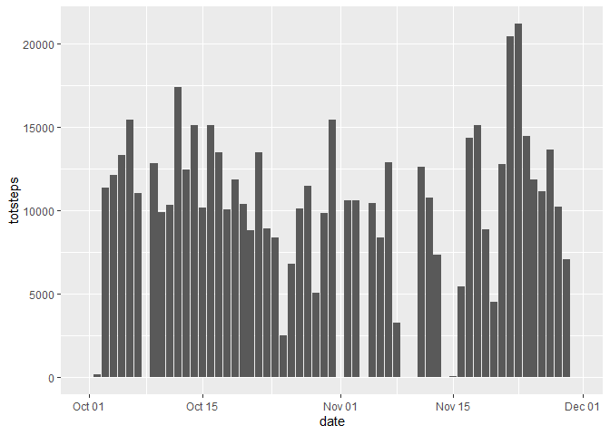
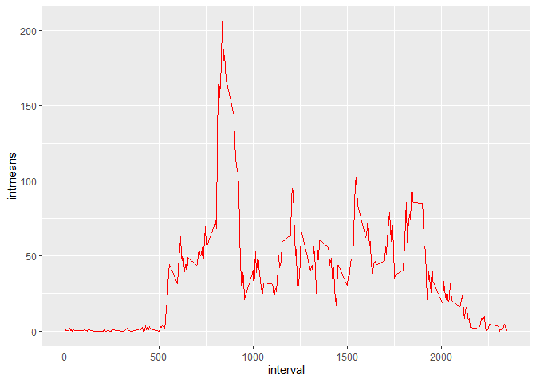
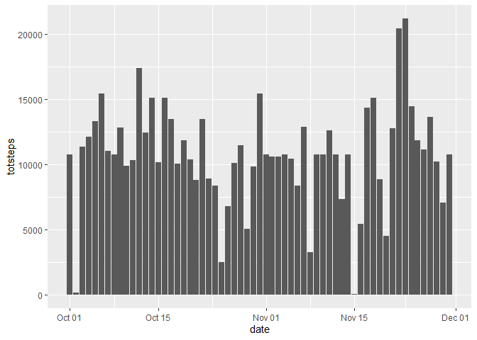
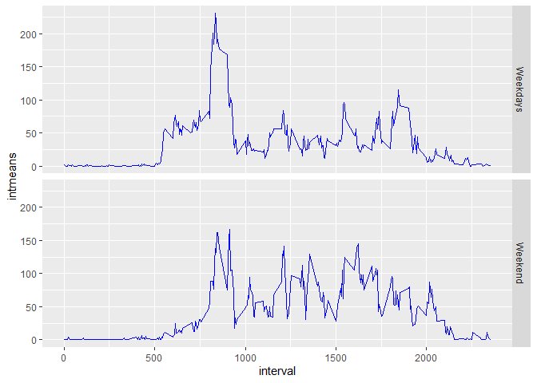

## Loading and preprocessing the data
Load the **libraries**.


```r
library(dplyr)
library(tidyverse)
library(ggplot2)
library(tidyr)
library(data.table)
library(zoo)
```

**Load the data**


```r
setwd("C:/Users/ok/Desktop/Coursera Reproducible Research/Week 2 Assignment/RepData_PeerAssessment1/RepData_PeerAssessment1/activity")
my_data <- read_csv("activity.csv")
data <- my_data
str(data)
```

```
## Classes 'spec_tbl_df', 'tbl_df', 'tbl' and 'data.frame':	17568 obs. of  3 variables:
##  $ steps   : num  NA NA NA NA NA NA NA NA NA NA ...
##  $ date    : Date, format: "2012-10-01" "2012-10-01" ...
##  $ interval: num  0 5 10 15 20 25 30 35 40 45 ...
##  - attr(*, "spec")=
##   .. cols(
##   ..   steps = col_double(),
##   ..   date = col_date(format = ""),
##   ..   interval = col_double()
##   .. )
```
This format is suitable for our analysis. 

## What is mean total number of steps taken per day?
Create a new col in the data frame with the total number of steps per day.

```r
data <- data %>% group_by(date) %>% mutate(totsteps = sum(steps, na.rm = TRUE))
```

**Make a histogram of the total number of steps taken each day.**

```r
stepsHist <- ggplot(data, aes(date,totsteps))
stepsHist + geom_histogram(stat="identity",position="dodge")
```

<!-- -->
     
**Calculate and report the mean and median total number of steps taken per day**

```r
data <- data %>% mutate(means = mean(totsteps, na.rm = TRUE))
data <- data %>% mutate(medians = median(totsteps, na.rm = TRUE))
avg <- mean(data$means)
mid <- median(data$medians)
```
  
So the means and medians cols added to the dataset gives the mean and median of the total number of steps per day. The mean number of steps per day is then given by 9354.2295082 and the median number is steps is given by 1.0395\times 10^{4}.

## What is the average daily activity pattern?
**Make a time series plot (i.e. type = "l") of the 5-minute interval (x-axis) and the average number of steps taken, averaged across all days (y-axis)**


```r
intdata <- my_data %>% group_by(interval) %>% summarise(intmeans = mean(steps, na.rm = TRUE))
iplot <- ggplot(intdata, aes(interval, intmeans))
iplot +geom_line(color = "red")
```

<!-- -->
  
**Which 5-minute interval, on average across all the days in the dataset, contains the maximum number of steps?**
  

```r
maxinterval <- filter(intdata, intmeans == max(intmeans))
```
  So the **interval with the maximum number of steps is 835.**
  
## Imputing missing values
  
**Calculate and report the total number of missing values in the dataset (i.e. the total number of rows with NAs)**


```r
nas <- sum(is.na(data$steps))
```
  The total number of NA's is 2304.
  
**Devise a strategy for filling in all of the missing values in the dataset. **
  

```r
data2 <- transform(my_data, steps = na.aggregate(steps, by = interval))
```
  
**Create a new dataset that is equal to the original dataset but with the missing data filled in.**


```r
str(data2)
```

```
## 'data.frame':	17568 obs. of  3 variables:
##  $ steps   : num  1.717 0.3396 0.1321 0.1509 0.0755 ...
##  $ date    : Date, format: "2012-10-01" "2012-10-01" ...
##  $ interval: num  0 5 10 15 20 25 30 35 40 45 ...
```
  **Make a histogram of the total number of steps taken each day and Calculate and report the mean and median total number of steps taken per day. **  

  For the histogram, 

```r
data2 <- data2 %>% group_by(date) %>% mutate(totsteps = sum(steps, na.rm = TRUE))
stepsHistnew <- ggplot(data2, aes(date,totsteps))
stepsHistnew + geom_histogram(stat="identity",position="dodge")
```

```
## Warning: Ignoring unknown parameters: binwidth, bins, pad
```

<!-- -->
  For the means and medians,
  

```r
data2 <- data2 %>% mutate(means = mean(totsteps, na.rm = TRUE))
data2 <- data2 %>% mutate(medians = median(totsteps, na.rm = TRUE))
newavg <- mean(data$means)
newmid <- median(data$medians)
```
  So the means and medians cols added to the dataset gives the mean and median of the total number of steps per day. The mean number of steps per day is then given by 9354.2295082 and the median number is steps is given by 1.0395\times 10^{4}.
  
## Are there differences in activity patterns between weekdays and weekends?
  **Create a new factor variable in the dataset with two levels – “weekday” and “weekend” indicating whether a given date is a weekday or weekend day.**
  

```r
data2$days <- weekdays(data2$date)
data2 <- data2 %>% 
  transform(days = as.factor(case_when(
         days %in% c("Monday", "Tuesday", "Wednesday", "Thursday", "Friday") ~ "Weekdays",
         days %in% c("Saturday", "Sunday") ~ "Weekend"
       )))
str(data2$days)
```

```
##  Factor w/ 2 levels "Weekdays","Weekend": 1 1 1 1 1 1 1 1 1 1 ...
```

  **Make a panel plot containing a time series plot (i.e. type = "l") of the 5-minute interval (x-axis) and the average number of steps taken, averaged across all weekday days or weekend days (y-axis).**
  


```r
data2 <- ungroup(data2)
#data2 <- transform(my_data, steps = na.aggregate(steps, by = interval))
intdata2 <- data2 %>% group_by(interval, days) %>% mutate(intmeans = mean(steps, na.rm = TRUE))
iplot2 <- ggplot(intdata2, aes(interval, intmeans))
iplot2 +geom_line(color = "blue") + facet_grid(days~.)
```

<!-- -->


